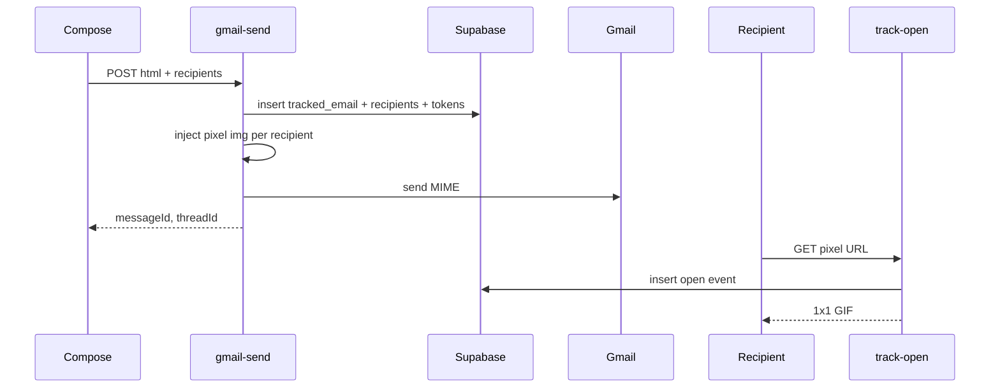
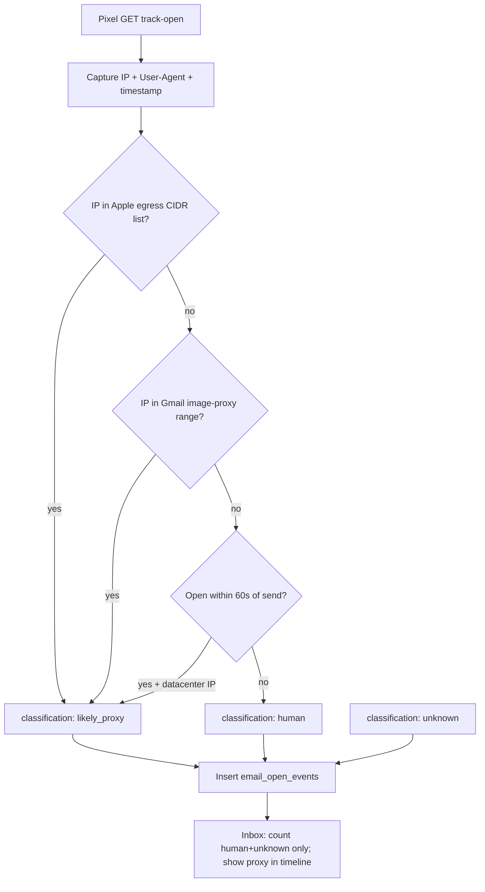

# Compose email open-tracking pixel

## Current state

- Compose sends via [`dash/overlays.jsx`](dash/overlays.jsx) → [`dash/gmail-inbox.js`](dash/gmail-inbox.js) → [`netlify/functions/gmail-send.mjs`](netlify/functions/gmail-send.mjs).
- UI already says **Send & Track** and toasts "Email sent & tracking ✓", but [`gmail-send.mjs`](netlify/functions/gmail-send.mjs) only appends free-plan branding — **no pixel, no DB rows, no open endpoint**.
- Inbox loads real Gmail **INBOX** only ([`netlify/functions/gmail-messages.mjs`](netlify/functions/gmail-messages.mjs)); sent messages hardcode `opens: 0` and an empty timeline ([`_gmail.mjs`](netlify/functions/_gmail.mjs) ~350–374).
- Notification prefs exist ([`notification_settings`](supabase/migrations/20250614100200_create_notification_settings.sql)) but are not wired to open events yet.



## 1. Supabase schema (new migration)

Add [`supabase/migrations/20250623120000_create_tracked_emails.sql`](supabase/migrations/20250623120000_create_tracked_emails.sql):

| Table | Purpose |
|-------|---------|
| `tracked_emails` | One row per Peekd send: `user_id`, `from_email`, `subject`, `gmail_message_id`, `gmail_thread_id`, `sent_at` |
| `tracked_recipients` | One row per TO address: `tracked_email_id`, `email`, `pixel_token` (unique, indexed) |
| `email_open_events` | Each pixel load: `tracked_recipient_id`, `opened_at`, `user_agent`, `ip`, `classification` (`human` / `likely_proxy` / `unknown`) |

**RLS:** authenticated users can `SELECT` their own sends/recipients/events (via `user_id` join). All writes use **service role** in Netlify functions (same pattern as [`_support.mjs`](netlify/functions/_support.mjs) `dbRequest`).

**Indexes:** unique on `pixel_token`; index on `gmail_message_id` for inbox merge.

## 2. Shared tracking helpers

Extend [`netlify/functions/_support.mjs`](netlify/functions/_support.mjs) or add a focused [`netlify/functions/_tracking.mjs`](netlify/functions/_tracking.mjs):

- `generatePixelToken()` — `crypto.randomBytes(16).toString('base64url')`
- `injectTrackingPixels(html, pixelUrls[])` — append before branding:
  ```html
  
  ```
  One image per recipient (supports multi-TO and per-recipient open counts in Inbox).
- `createTrackedSend({ userId, fromEmail, subject, to[], gmailMessageId, gmailThreadId })` — insert parent + recipient rows, return tokens
- `getTrackingByMessageIds(userId, gmailMessageIds[])` — batch lookup for inbox merge
- `buildTimelineFromEvents(events)` — map DB rows to existing inbox timeline shape (`opened`, `sent`, etc.)

Reuse `siteUrl()` from `_support.mjs` for pixel base URL.

## 3. Inject pixel on send

Update [`netlify/functions/gmail-send.mjs`](netlify/functions/gmail-send.mjs):

1. After validation, create `tracked_emails` + `tracked_recipients` rows **before** send (or immediately after successful Gmail send using returned `messageId` — prefer **after send succeeds** so we don't orphan rows on failure).
2. Build pixel URLs from tokens; call `injectTrackingPixels(finalHtml, urls)`.
3. Then append free-plan branding (if `addBranding`).
4. Return `{ ok: true, messageId, threadId, trackedEmailId }` (optional extra field for client).

Accept `track: true` in body (default **true** for compose; allows future opt-out toggle).

No client change strictly required beyond optionally passing `track: true` from [`dash/gmail-inbox.js`](dash/gmail-inbox.js).

## 4. Public open endpoint

New [`netlify/functions/track-open.mjs`](netlify/functions/track-open.mjs):

- `GET ?k=TOKEN` only (mail clients load images via GET).
- Lookup `tracked_recipients` by token (service role).
- Insert `email_open_events` row (record every load = supports "opened again").
- Response: **1x1 transparent GIF** with `Cache-Control: no-store, no-cache, must-revalidate` (critical — cached pixels miss re-opens).
- Invalid/missing token: still return GIF (don't leak whether token exists).
- No auth, no CORS complexity.

## 5. Inbox: load sent mail + merge tracking

Update [`netlify/functions/gmail-messages.mjs`](netlify/functions/gmail-messages.mjs) and [`_gmail.mjs`](netlify/functions/_gmail.mjs):

- Fetch **both** `SENT` and `INBOX` (or `SENT` only for tracked-stats merge — recommend fetching `SENT` in addition to current `INBOX`, dedupe by message id).
- After Gmail fetch, call `getTrackingByMessageIds(user.id, messageIds)`.
- For each message with tracking data:
  - Set `opens` = total open count (sum across recipients or primary recipient — show total on row).
  - Set `badge` = `OPENED` if opens > 0 else `SENT`.
  - Build `timeline`: `sent` + one `opened` entry per event (with relative time via existing `relativeTime`).
  - Set `lastOpened`, `hot` (e.g. opens in last hour).

Detail view in [`dash/inbox.jsx`](dash/inbox.jsx) already renders `timeline` and `opens` — no major UI rewrite needed once API returns real data.

Per-recipient engagement dropdown can use recipient-level open counts from merged payload (`recipientOpens[]`).

## 6. Apple Mail Privacy Protection (preload) — classification, not prevention

**Important limitation:** Apple MPP cannot be “fixed” in the sense of stopping preloads. When MPP is on, Apple fetches all images (including our pixel) at delivery time through its proxy, often before the recipient reads the message. We **record every pixel hit**, then **classify** which ones are likely machine-generated vs. human.

This matches the product copy already in [`dash/help.jsx`](dash/help.jsx): *“We flag likely proxy opens in the timeline.”*

### How classification works



### IP list source (primary signal)

Apple publishes the egress IPs used for Mail Privacy Protection / Private Relay:

- **URL:** `https://mask-api.icloud.com/egress-ip-ranges.csv`
- **Format:** CIDR prefix, country, region, city (country/region useful for *approximate* geo on proxy opens)
- **Maintenance:** ranges rotate; refresh **daily** (build script or Netlify scheduled function)

Add [`scripts/fetch-apple-egress-ips.js`](scripts/fetch-apple-egress-ips.js) run at build (alongside [`scripts/generate-config.js`](scripts/generate-config.js)) to write `netlify/functions/_apple-egress-ips.json`. [`_tracking.mjs`](netlify/functions/_tracking.mjs) loads this file and exposes `isAppleProxyIp(ip)`.

**Secondary signal (v1):** small hardcoded Gmail image-proxy CIDRs (e.g. `66.249.x`, `209.85.x` blocks) — Gmail also prefetches images and causes false opens.

**Tertiary signal (v1):** if first open occurs **&lt; 60 seconds** after `tracked_emails.sent_at` *and* IP is a known datacenter/proxy range, bump confidence to `likely_proxy`.

User-Agent alone is **unreliable** for MPP; use IP matching first.

### At ingest (`track-open.mjs`)

1. Read client IP from Netlify headers (`x-nf-client-connection-ip`, fallback `x-forwarded-for`).
2. Call `classifyOpen({ ip, userAgent, sentAt })` → `human` | `likely_proxy` | `unknown`.
3. Store `classification` on `email_open_events`.

### Inbox / analytics behavior

| Surface | Rule |
|---------|------|
| **Open count** (`opens` badge, row chip) | Count only `human` + `unknown` (exclude `likely_proxy`) |
| **Timeline** | Show all events; proxy opens use a distinct entry, e.g. label **“Likely proxy open (Apple Mail)”**, muted style, optional approximate region from Apple CSV |
| **Notifications** (when wired) | Fire only on `human` or `unknown`, not `likely_proxy` |
| **“Opened again”** | Re-opens from same recipient still counted if `human`/`unknown` |

### What we still cannot know

- With MPP **enabled**, a real human read may produce **no new pixel request** (images already cached on device) → under-counting is possible.
- With MPP **disabled**, opens are more reliable but location/device data is more accurate.
- Other scanners (Proofpoint, Mimecast, corporate gateways) also prefetch pixels — can extend the same classification table later.

### Files added for MPP

| File | Change |
|------|--------|
| `scripts/fetch-apple-egress-ips.js` | Download + parse Apple CSV at build |
| `netlify/functions/_apple-egress-ips.json` | Generated CIDR list (committed or build artifact) |
| `netlify/functions/_tracking.mjs` | `isAppleProxyIp`, `classifyOpen`, CIDR matcher |
| `netlify/functions/track-open.mjs` | Capture IP/UA, classify, store |
| `dash/inbox.jsx` | Render `likely_proxy` timeline events with flag styling |

## 7. Optional v1.1 (defer unless quick)

- **Open notifications:** on new open, if `notification_settings.email_opens_enabled`, send Resend alert (reuse `sendTicketEmail` / Resend pattern from [`_support.mjs`](netlify/functions/_support.mjs)); respect `classification !== 'likely_proxy'`.
- **Compose Track toggle:** UI toggle default on (matches help copy); wire `track` flag through compose.
- **Extended scanner lists:** Proofpoint / Mimecast / Microsoft Safe Links IP feeds.

## 8. Deploy checklist

- Run migration in Supabase.
- No new Netlify env vars (uses existing `SUPABASE_*` + `URL`).
- Verify Resend not required for pixel itself.
- Test: send to yourself, open in Gmail with images on, confirm row in `email_open_events` and Inbox shows open count after refresh.

## Files to touch (estimated)

| File | Change |
|------|--------|
| `supabase/migrations/20250623120000_create_tracked_emails.sql` | New tables + RLS |
| `netlify/functions/_tracking.mjs` | Helpers (or extend `_support.mjs`) |
| `netlify/functions/track-open.mjs` | Pixel endpoint |
| `netlify/functions/gmail-send.mjs` | Create records + inject pixels |
| `netlify/functions/gmail-messages.mjs` | Fetch SENT + merge tracking |
| `netlify/functions/_gmail.mjs` | Support multi-label fetch / merge hook |
| `dash/gmail-inbox.js` | Pass `track: true` on send |

## Testing plan

1. Send composed email to external address; inspect sent HTML source for pixel `img` tags.
2. Open email; hit `track-open` in Netlify function logs; confirm `email_open_events` row.
3. Reload Inbox; sent email shows `OPENED` badge and timeline entry.
4. Re-open email; open count increments ("opened again").
5. Multi-recipient send: two pixels, independent counts per recipient in detail view.
6. **Apple MPP:** send to an `@icloud.com` / Apple Mail account with MPP on; confirm an immediate `likely_proxy` event (often within seconds of delivery), excluded from open count but visible in timeline as flagged.
7. **Non-Apple client:** send to Gmail web / Outlook with images on; confirm `human` or `unknown` classification and inclusion in open count.
